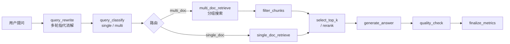

# 🧠 Knowledge Base RAG System

> 基于 LangGraph + Milvus 的企业级知识库问答系统，支持多轮对话、混合检索、Rerank、图文解析、Excel 结构化切分。

<p align="center">
  
  
  
  
  
  
</p>

---

## 📸 界面预览

**系统首页** — 知识库列表与管理入口，支持创建、配置、删除知识库。

<p align="center">
  
</p>

**普通对话检索效果** — 基于混合检索（Dense + BM25 + RRF）的问答结果，命中精准，来源可溯。下图为在一本三国演义中问一个细节。共1000+切片。

<p align="center">
  
  
</p>

**知识库命中测试** — 展示检索召回的 chunk 内容及相关度评分，便于调试和验证检索质量。

<p align="center">
  
</p>

**图文并茂对话 & 多模态效果** — 自动提取 PDF/DOCX 中的图片，LLM 回答时同步展示关联图片，支持图文混合理解。

<p align="center">
  
  
  
</p>

---

## ✨ 功能亮点

- **多轮对话记忆** — 基于 LangGraph checkpointer，重启不丢失，支持指代消解
- **混合检索** — Dense（语义）+ BM25（关键词）+ RRF 融合，可选 Rerank 精排
- **Rerank 支持** — 集成 qwen3-rerank，检索候选池与最终 top-k 独立配置
- **图文模式** — 自动提取 PDF/DOCX 图片，与文本切片关联，LLM 回答可展示图片
- **Excel 结构化切分** — 逐 sheet 配置列选择和别名，每行转为 `key=value` 格式，LLM 精准理解表格
- **切分与向量化解耦** — 切分后人工审查，手动触发向量化；大文件分批容错，失败可重试
- **每库独立检索配置** — ranker / top_k / group_size / memory_turns / rerank 参数按知识库隔离
- **知识图谱联动** — 可选同步切片到知识图谱，RAG 问答融合图谱检索结果

---

## 🚀 快速开始

### 1. 启动基础服务

```bash
docker-compose up -d
# 首次启动需等待 30-60 秒，直到所有服务变为 healthy
docker-compose ps
```

### 2. 配置环境变量

```bash
cd backend
cp .env.example .env
```

| 必填变量 | 说明 |
|----------|------|
| `DASHSCOPE_API_KEY` | 阿里云 DashScope API Key |
| `PG_HOST` / `PG_USER` / `PG_PASSWORD` | PostgreSQL 连接信息 |
| `MILVUS_HOST` | Milvus 连接地址 |

### 3. 安装依赖并启动后端

```bash
pip install -r requirements.txt
pip install "psycopg[binary]" langgraph-checkpoint-postgres  # LangGraph checkpoint 依赖
python main.py
```

后端默认运行在 `http://localhost:8000`，启动时自动建表。

### 4. 启动前端

```bash
cd frontend
npm install
npm run dev
```

前端默认运行在 `http://localhost:5173`。

---

## 🗺️ RAG 流水线



---

## 🛠️ 技术栈

| 层 | 技术 |
|----|------|
| 后端框架 | FastAPI + Uvicorn |
| Agent 编排 | LangGraph（StateGraph + AsyncPostgresSaver） |
| LLM / Embedding / Rerank | 阿里云 DashScope（Qwen 系列） |
| 向量数据库 | Milvus Standalone |
| 业务数据库 | PostgreSQL |
| 对象存储 | 本地文件系统（可选 OSS） |
| 前端 | Vue 3 + Vite + Element Plus |

---

## 📁 项目结构

<details>
<summary>展开查看</summary>

```
├── docker-compose.yml
├── backend/
│   ├── app/
│   │   ├── api/v1/           # REST API 路由
│   │   ├── core/             # 配置、日志、异常、Prompt
│   │   ├── services/         # 业务逻辑（含 rerank_service、chunk_splitter）
│   │   └── db/               # Repository 层
│   └── agents/
│       └── knowledge/        # RAG Agent（核心流水线）
├── frontend/
│   └── src/
│       ├── components/       # Vue 组件（含 ExcelCategoryUpload）
│       └── services/         # API 调用（docApi.js）
└── docs/                     # 架构文档 + 截图
```

</details>

---

## 🔧 服务端口

| 服务 | 端口 |
|------|------|
| 后端 API | 8000 |
| 前端 | 5173 |
| PostgreSQL | 5432 |
| Milvus | 19530 |
| Attu（Milvus GUI） | 8080 |
| MinIO Console | 9001 |

---

## ❓ 常见问题

<details>
<summary>展开查看</summary>

**Milvus 启动慢？**
首次启动需初始化 etcd 和 MinIO，等 `docker-compose ps` 显示 `healthy` 再启后端。

**embedding 报 batch size 错误？**
`text-embedding-v3` 单批上限 10 条，`.env` 中 `EMBEDDING_BATCH_SIZE` 请设为 10。

**切分后 job 停在 `chunked`？**
正常，切分与向量化解耦。在文件列表页点"上传向量库"手动触发。

**向量化大文件部分失败？**
系统分批（每批 100 条）独立重试，失败时 job 保持 `chunked`，重新点"上传向量库"可安全重试（upsert 幂等）。

**Rerank 如何开启？**
在知识库检索配置中将 `rerank_enabled` 设为开启，确认 DashScope 已开通 `qwen3-rerank` 权限。多模态知识库自动跳过 rerank。

**上传同名文件报 409？**
设计如此，防止静默覆盖。先在文件列表删除旧版本再重新上传。

</details>

---

## License

MIT © 2026 YK
